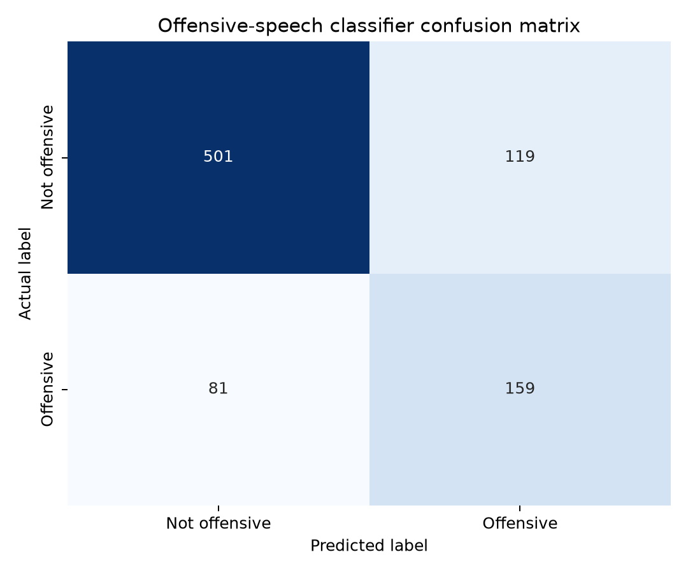
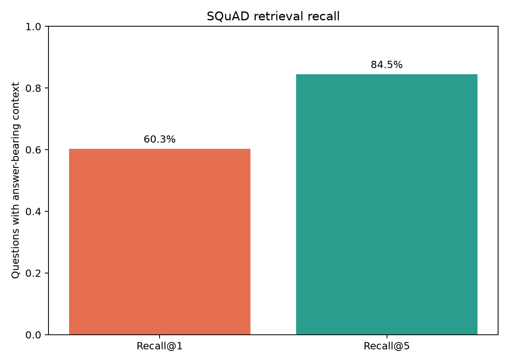
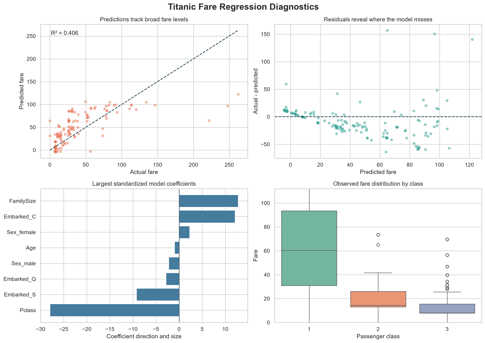

# Data Analytics Portfolio

A practical portfolio showing NLP safety, retrieval evaluation, machine learning, SQL analysis, and reproducible Python workflows.

## About Me
I am a data and machine-learning practitioner focused on turning raw data into reliable, explainable systems. My projects emphasize NLP classification, retrieval evaluation, privacy-aware preprocessing, model diagnostics, and clear communication of limitations.

## Core Skills
- SQL analysis and business querying
- Python data cleaning and exploratory analysis
- KPI analysis and trend monitoring
- Data visualization and reporting
- Introductory machine learning and regression
- NLP classification and text preprocessing
- Retrieval evaluation and RAG foundations
- Model evaluation, error analysis, and privacy masking
- Business insight communication

## Key Findings
These are the main findings from the current projects in this portfolio:

- West was the highest revenue-generating region
- Electronics was the strongest product category by revenue
- Corporate customers generated the largest share of revenue
- Online sales outperformed in-store sales across the retail dataset
- In the Kaggle Titanic dataset, the overall survival rate was 38.4%
- Female passengers had a 74.2% survival rate compared with 18.9% for male passengers
- First-class passengers had a 63.0% survival rate compared with 24.2% for third-class passengers
- A linear regression model predicted Titanic ticket fare with a $20.65 mean absolute error on the test split
- A TweetEval offensive-speech classifier reached 0.710 validation macro F1 and 0.72 held-out test macro F1
- A TF-IDF SQuAD retriever reached 60.3% Recall@1 and 84.5% Recall@5

## Featured Projects

### 1. NLP Safety Pipeline: Offensive-Speech Detection
This project uses the real TweetEval benchmark to classify offensive language with TF-IDF and class-balanced logistic regression. It includes macro F1, precision, recall, confusion-matrix analysis, and PII masking for emails, phone numbers, and usernames.

See: [projects/nlp-safety-pipeline/README.md](projects/nlp-safety-pipeline/README.md)

### 2. RAG Retrieval Evaluation: SQuAD
This project evaluates the retrieval stage of a RAG system on real SQuAD data, measuring Recall@1 and Recall@5 with a transparent TF-IDF baseline before introducing embeddings or an LLM generator.

See: [projects/rag-retrieval-evaluation/README.md](projects/rag-retrieval-evaluation/README.md)

### 3. SQL Sales Analysis
This project answers business questions using SQL including revenue aggregation, monthly trend analysis, channel comparison, and customer segment breakdown.

See: [projects/sql-analysis/README.md](projects/sql-analysis/README.md)

### 4. Python EDA Project
This project loads a retail dataset, cleans the data, analyzes revenue trends, and produces business-facing charts and recommendations.

See: [projects/python-eda/README.md](projects/python-eda/README.md)

### 5. Dashboard Project
This project translates the analysis into an executive summary for decision-makers, focusing on KPIs, performance trends, and commercial recommendations.

See: [projects/dashboard-project/README.md](projects/dashboard-project/README.md)

### 6. Kaggle Titanic Survival Analysis
This project uses the real public Titanic competition dataset to demonstrate cleaning, feature engineering, survival-rate analysis, visualization, and responsible interpretation.

See: [projects/kaggle-project/README.md](projects/kaggle-project/README.md)

### 7. Linear Regression: Titanic Fare Prediction
This project uses the same real dataset to demonstrate a readable machine-learning workflow: preprocessing, one-hot encoding, train/test evaluation, baseline comparison, and diagnostic visualization.

See: [projects/linear-regression/README.md](projects/linear-regression/README.md)

## Selected Evaluation Visuals

### Offensive-speech classifier

### RAG retrieval recall

### Linear regression diagnostics

## Repository Structure
- `data/` — raw and cleaned datasets
- `sql/` — SQL query scripts and business logic
- `projects/` — project folders with documentation and analysis files
- `images/` — chart output and visual summaries
- `docs/` — supporting notes and framework

## Contact
- LinkedIn: https://www.linkedin.com/in/tmushtaq/
- Email: tmushtaq599@outlook.com
- GitHub: [github.com/](https://github.com/tmushtaq12/)
- Website: [Personal website](https://www.talhahmushtaq.com/)
- Business: [Motorcycle shop](https://ironmoto.lt/)
- 

## Notes
This portfolio is intentionally clear, practical, and easy to expand with additional analyses over time.
