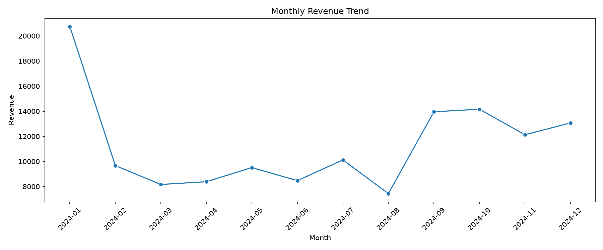
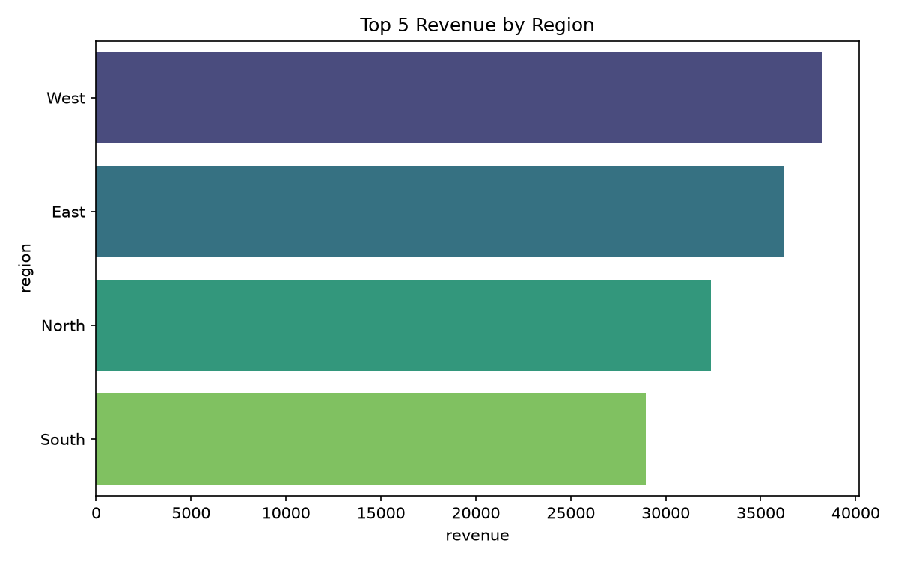
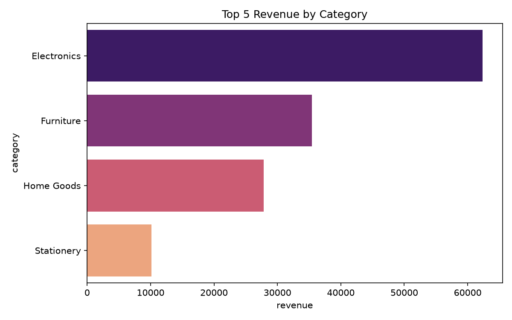

# Data Analytics Portfolio

A practical portfolio of retail analytics work showing business problem solving, SQL analysis, Python exploratory analysis, and dashboard storytelling.

## About Me
I am a data analyst focused on turning raw business data into clear, actionable insight. My projects answer practical questions through SQL, Python, visualization, and structured reporting.

## Core Skills
- SQL analysis and business querying
- Python data cleaning and exploratory analysis
- KPI analysis and trend monitoring
- Data visualization and reporting
- Business insight communication

## Key Findings
These are the main findings from the current projects in this portfolio:

- West was the highest revenue-generating region
- Electronics was the strongest product category by revenue
- Corporate customers generated the largest share of revenue
- Online sales outperformed in-store sales across the retail dataset
- In the Kaggle Titanic dataset, the overall survival rate was 38.4%
- Female passengers had a 74.2% survival rate compared with 18.9% for male passengers
- First-class passengers had a 63.0% survival rate compared with 24.2% for third-class passengers

## Featured Projects

### 1. SQL Sales Analysis
This project answers business questions using SQL including revenue aggregation, monthly trend analysis, channel comparison, and customer segment breakdown.

See: [projects/sql-analysis/README.md](projects/sql-analysis/README.md)

### 2. Python EDA Project
This project loads a retail dataset, cleans the data, analyzes revenue trends, and produces business-facing charts and recommendations.

See: [projects/python-eda/README.md](projects/python-eda/README.md)

### 3. Dashboard Project
This project translates the analysis into an executive summary for decision-makers, focusing on KPIs, performance trends, and commercial recommendations.

See: [projects/dashboard-project/README.md](projects/dashboard-project/README.md)

### 4. Kaggle Titanic Survival Analysis
This project uses the real public Titanic competition dataset to demonstrate cleaning, feature engineering, survival-rate analysis, visualization, and responsible interpretation.

See: [projects/kaggle-project/README.md](projects/kaggle-project/README.md)

## Project Screenshots

### Monthly revenue trend

### Revenue by region

### Revenue by category

### Kaggle survival analysis

## Repository Structure
- `data/` — raw and cleaned datasets
- `sql/` — SQL query scripts and business logic
- `projects/` — project folders with documentation and analysis files
- `images/` — chart output and visual summaries
- `docs/` — supporting notes and framework

## Contact
- LinkedIn: https://www.linkedin.com/in/tmushtaq/
- Email: tmushtaq599@outlook.com
- GitHub: [github.com/](https://github.com/tmushtaq12/)
- Website: [Personal website](https://www.talhahmushtaq.com/)
- Business: [Motorcycle shop](https://ironmoto.lt/)
- 

## Notes
This portfolio is intentionally clear, practical, and easy to expand with additional analyses over time.
