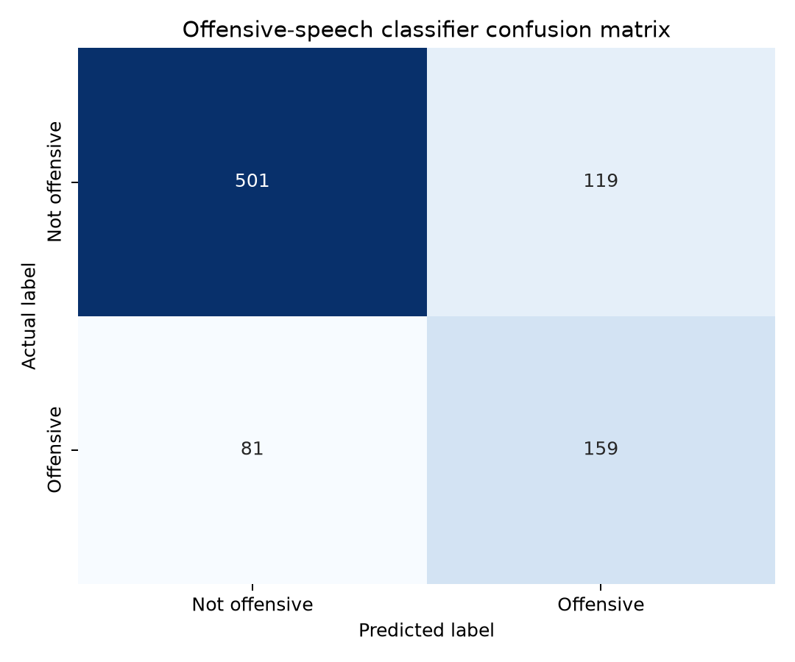
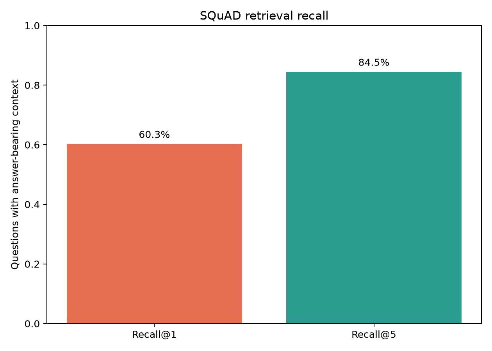
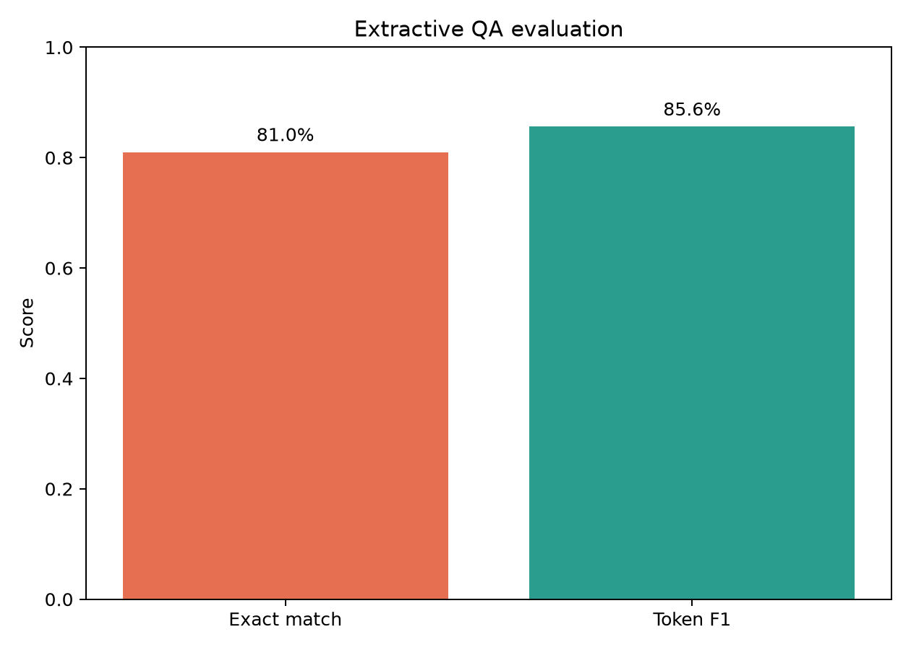
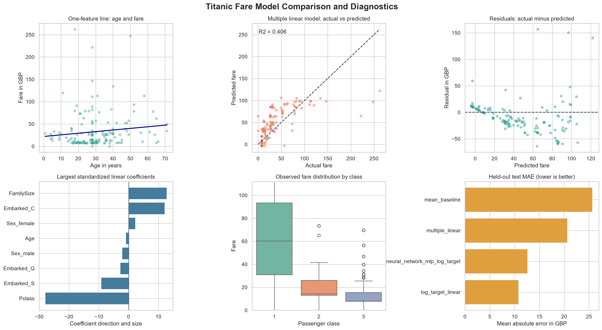
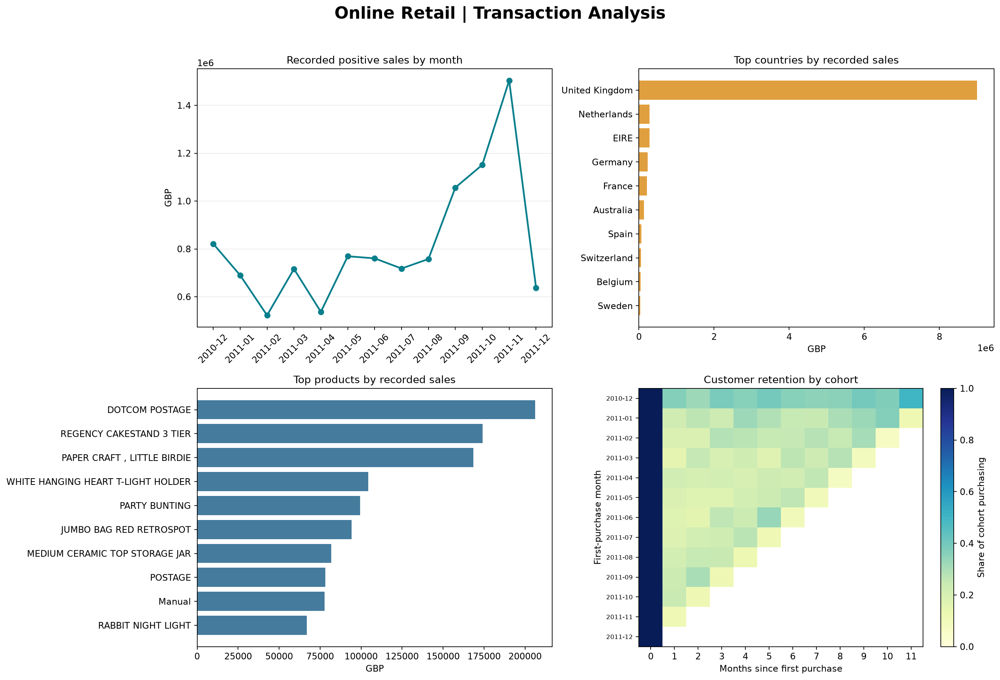

# Data Analytics Portfolio

A practical portfolio of reproducible data analysis, machine learning, NLP safety, retrieval evaluation, and GenAI measurement. The projects distinguish benchmark results from exploratory associations and document dataset limits rather than treating a chart as proof.

## About Me
I am a data and machine-learning practitioner focused on turning raw data into reliable, explainable systems. My projects emphasize NLP classification, retrieval evaluation, privacy-aware preprocessing, model diagnostics, and clear communication of limitations.

## Core Skills
- SQL analysis and business querying
- Python data cleaning and exploratory analysis
- KPI analysis and trend monitoring
- Data visualization and reporting
- Customer segmentation and cohort retention
- Data-quality auditing and SQL window functions
- Introductory machine learning and regression
- NLP classification and text preprocessing
- Retrieval evaluation and RAG foundations
- Model evaluation, error analysis, and privacy masking
- Business insight communication

## Key Findings
These are the main findings from the current projects in this portfolio:

- In the UCI Online Retail source, 541,909 invoice lines span 2010-12-01 through 2011-12-09
- After excluding 5,268 extra exact duplicate rows and applying the documented positive-sale definition, 524,878 lines represent GBP 10,642,110.80 in recorded positive sales
- The retail analysis covers 19,960 positive-sale invoices, 4,338 identified customers, 38 countries, and 4,070 stock codes
- The source also contains 135,080 rows without a customer ID and 9,288 cancellation-invoice lines; customer analysis excludes unknown IDs and credits are reported separately
- In the Kaggle Titanic dataset, the overall survival rate was 38.4%
- Female passengers had a 74.2% survival rate compared with 18.9% for male passengers
- First-class passengers had a 63.0% survival rate compared with 24.2% for third-class passengers
- A linear regression model predicted Titanic ticket fare with a $20.65 mean absolute error on the test split
- A TweetEval offensive-speech classifier reached 0.710 validation macro F1 and 0.72 held-out test macro F1
- A TF-IDF SQuAD retriever reached 60.3% Recall@1 and 84.5% Recall@5
- A local DistilBERT QA evaluation reached 81.0% exact match and 85.6% token F1 with 173 ms mean latency

## Featured Projects

### 1. Retail Transaction Analytics Capstone
An end-to-end UCI Online Retail analysis joining source-data validation, Python EDA, eight executable SQLite queries, product and country mix, invoice metrics, RFM customer segments, monthly cohorts, retention, and a generated dashboard. The workbook is downloaded on demand and the exact sales/duplicate/credit definitions are documented.

See: [projects/retail-analytics/README.md](projects/retail-analytics/README.md)

### 2. NLP Safety Pipeline: Offensive-Speech Detection
This project uses the real TweetEval benchmark to classify offensive language with TF-IDF and class-balanced logistic regression. It includes macro F1, precision, recall, confusion-matrix analysis, and PII masking for emails, phone numbers, and usernames.

See: [projects/nlp-safety-pipeline/README.md](projects/nlp-safety-pipeline/README.md)

### 3. RAG Retrieval Evaluation: SQuAD
This project evaluates the retrieval stage of a RAG system on real SQuAD data, measuring Recall@1 and Recall@5 with a transparent TF-IDF baseline before introducing embeddings or an LLM generator.

See: [projects/rag-retrieval-evaluation/README.md](projects/rag-retrieval-evaluation/README.md)

### 4. GenAI Evaluation Lab: Extractive QA
This project runs a real Hugging Face QA model against SQuAD and records exact match, token F1, mean latency, P95 latency, and representative errors in a versioned experiment artifact.

See: [projects/genai-evaluation-lab/README.md](projects/genai-evaluation-lab/README.md)

### 5. Kaggle Titanic Survival Analysis
This project uses the real public Titanic competition dataset to demonstrate cleaning, feature engineering, survival-rate analysis, visualization, and responsible interpretation.

See: [projects/kaggle-project/README.md](projects/kaggle-project/README.md)

### 6. Linear Regression: Titanic Fare Prediction
This project uses the same real dataset to demonstrate a readable machine-learning workflow: preprocessing, one-hot encoding, train/test evaluation, baseline comparison, and diagnostic visualization.

See: [projects/linear-regression/README.md](projects/linear-regression/README.md)

### Supporting SQL, EDA, and Reporting Exercises
The original `sql-analysis`, `python-eda`, and `dashboard-project` folders are small learning exercises around a 48-row retail file. They are retained as practice material, not used as the portfolio's evidence-backed retail result. The capstone above is the full-scale version; the supporting READMEs explain the distinction.

## Selected Evaluation Visuals

### Offensive-speech classifier

### RAG retrieval recall

### GenAI QA evaluation

### Linear regression diagnostics

### Retail transaction analysis

## Repository Structure
- `data/` — tracked benchmark datasets and ignored downloaded/processed project data
- `sql/` — SQL query scripts and business logic
- `projects/` — project folders with documented questions, reproducible code, tests, and results
- `images/` — chart output and visual summaries
- `docs/` — supporting notes and framework

## Learn From This Portfolio

The [learning guide](docs/learning-guide.md) explains the concepts behind each project, gives exercises to reproduce the results, and lays out a path from classical NLP to RAG, GenAI evaluation, APIs, and production engineering.

## Contact
- LinkedIn: https://www.linkedin.com/in/tmushtaq/
- Email: tmushtaq599@outlook.com
- GitHub: [github.com/](https://github.com/tmushtaq12/)
- Website: [Personal website](https://www.talhahmushtaq.com/)
- Business: [Motorcycle shop](https://ironmoto.lt/)
- 

## Notes
This portfolio is intentionally clear, practical, and easy to expand with additional analyses over time.
