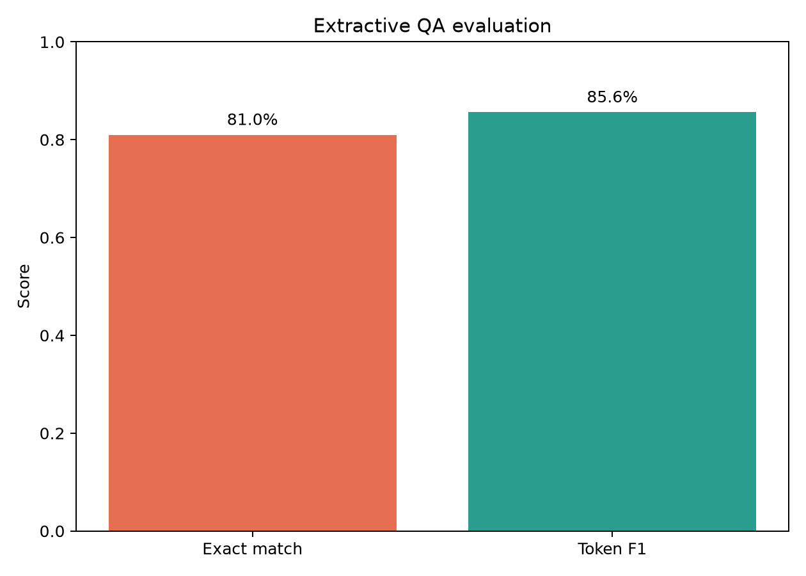

# GenAI Evaluation Lab: Extractive QA

## Why This Project Matters

A GenAI system is not complete when a model returns text. It needs a repeatable evaluation contract covering quality, errors, and latency. This project demonstrates that contract on a real question-answering benchmark.

## Real Dataset

The evaluation uses the real SQuAD v2 development dataset. The script selects the first 100 answerable examples deterministically so the result is quick and reproducible.

## Model

- `distilbert-base-cased-distilled-squad`
- Hugging Face Transformers pipeline
- Extractive question answering: the model must select an answer span from the supplied context

This is a deliberately bounded local model experiment. It is not presented as a production LLM or a substitute for an enterprise chat model.

## Evaluation Contract

For every question, the script records:

- **Exact match** — normalized prediction exactly matches an accepted answer
- **Token F1** — partial token overlap between prediction and reference
- **Mean latency** — average response time on the local runtime
- **P95 latency** — tail latency useful for service-level discussions
- **Error examples** — representative failures for review

The results are written to `experiment.json`, which acts as a lightweight experiment-tracking artifact.

## Run It

```powershell
python projects/genai-evaluation-lab/evaluation.py
```

Required packages:

```powershell
pip install transformers torch matplotlib
```

The first run downloads the model from Hugging Face. Later runs use the local model cache.

## Output



The script also writes `experiment.json` with the model name, dataset slice, quality metrics, latency metrics, and sample errors.

## How This Maps to Production

The same evaluation boundary can be adapted to an API-backed model by replacing the `qa_model(...)` call with an adapter for an OpenAI-compatible endpoint, Azure OpenAI, Bedrock, or another provider. The scoring code remains independent of the provider.

A production extension would add:

- prompt/version tracking
- retrieval context and citation checks
- faithfulness and hallucination labels
- adversarial and multilingual test sets
- human review workflows
- experiment storage in MLflow or a warehouse
- latency and cost tracking per model/version
- deployment behind a Docker service with authentication and audit logging

## Files

- `evaluation.py` — readable evaluation runner and metric implementation
- `experiment.json` — generated experiment record
- `../../data/raw/squad/dev-v2.0.json` — real benchmark data
- `../../images/genai_qa_evaluation.png` — generated quality visual
