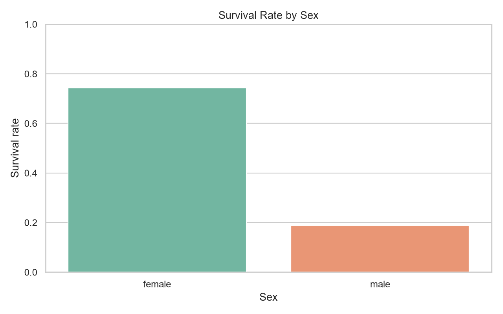
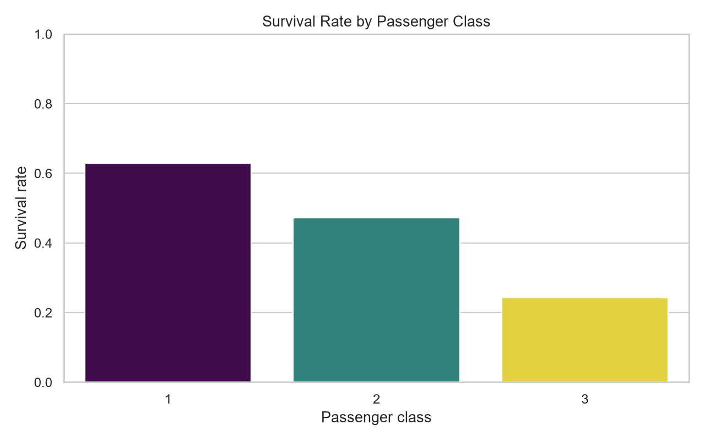
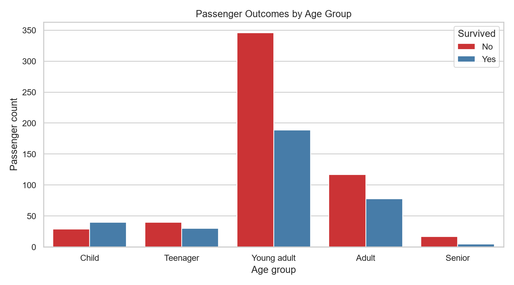

# Kaggle Titanic Survival Analysis

## Project Status
This is a working analysis of the classic [Kaggle Titanic dataset](https://www.kaggle.com/competitions/titanic/data), not a placeholder. The dataset contains 891 passenger records and the target variable is whether each passenger survived.

## Business Question
Which passenger characteristics were most associated with survival, and how can the findings be communicated clearly to a non-technical audience?

## Dataset
The CSV contains passenger-level data including:

- `Survived` — target variable: 0 = did not survive, 1 = survived
- `Pclass` — passenger class
- `Sex` — passenger sex
- `Age` — passenger age
- `SibSp` and `Parch` — family members aboard
- `Fare` — ticket fare
- `Embarked` — port of embarkation

The source file is stored locally at `data/raw/titanic.csv` so the analysis can be reproduced without an API key.

## Analysis Workflow
1. Load 891 records from the CSV
2. Fill missing ages with the dataset median
3. Fill the missing embarkation value with the mode
4. Create `FamilySize`, `IsAlone`, and `AgeGroup` features
5. Compare survival rates by sex and passenger class
6. Generate charts and a concise written conclusion

## Results From the Actual Run

| Metric | Result |
| --- | ---: |
| Records analyzed | 891 |
| Overall survival rate | 38.4% |
| Female survival rate | 74.2% |
| Male survival rate | 18.9% |
| 1st-class survival rate | 63.0% |
| 2nd-class survival rate | 47.3% |
| 3rd-class survival rate | 24.2% |

## Key Findings
- Sex is the clearest single segmentation: the female survival rate was substantially higher than the male rate.
- Passenger class also mattered: first-class passengers had a much higher survival rate than third-class passengers.
- Travelling with family was associated with a different outcome pattern than travelling alone, so family structure is worth including in a predictive model.
- These are associations from an exploratory analysis, not proof that one variable alone caused the outcome.

## Generated Visuals







## Files
- `analysis.py` — reproducible cleaning, metrics, charts, and printed findings
- `summary.md` — short stakeholder-style conclusion
- `../../data/raw/titanic.csv` — the real public dataset used by the script

## Run It

```powershell
python projects/kaggle-project/analysis.py
```

Required packages:

```powershell
pip install pandas matplotlib seaborn
```

## What This Demonstrates
This project demonstrates a complete Kaggle-style workflow: working with a real dataset, handling missing values, engineering useful features, comparing groups, producing visual evidence, and explaining the limits of the conclusion.
