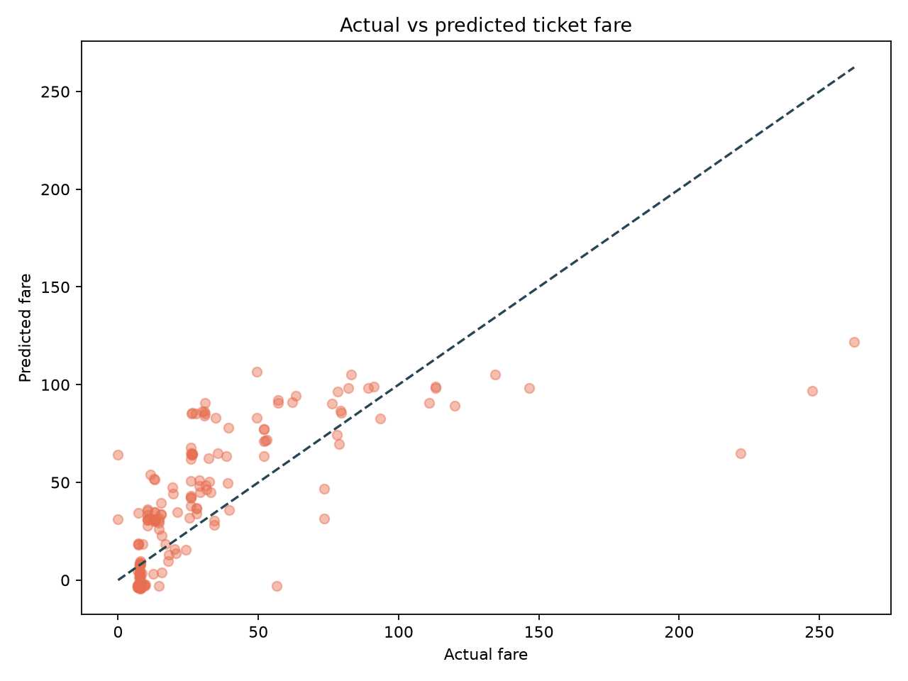

# Linear Regression: Titanic Fare Prediction

## Objective
Build a simple, interpretable machine-learning model that predicts a passenger's ticket fare from information available before the voyage.

This is a deliberately focused project. It shows the complete modeling workflow without hiding the evaluation behind a large framework.

## Target
`Fare`, the passenger's ticket price.

## Features
- `Pclass` — passenger class
- `Sex` — passenger sex
- `Age` — passenger age
- `FamilySize` — `SibSp + Parch + 1`
- `Embarked` — boarding port

The model does not use `Survived`, `Name`, `Ticket`, or `Cabin`. Those fields are either unrelated to the pricing question, too sparse, or unsuitable for this simple baseline.

## Method
1. Load the real Titanic CSV used by the Kaggle project
2. Fill missing age and embarkation values
3. Create the family-size feature
4. Split the data into 80% training and 20% test records
5. Standardize numeric features
6. One-hot encode categorical features
7. Fit `LinearRegression`
8. Compare the model against a baseline that always predicts the training-set mean fare

All preprocessing is inside a scikit-learn `Pipeline`, so the test set is not used when fitting transformations.

## Evaluation Metrics
- **MAE**: average absolute prediction error in currency units
- **RMSE**: penalizes larger errors more heavily
- **R2**: proportion of target variation explained by the model

## Results
Run the script to reproduce the current metrics:

```powershell
python projects/linear-regression/analysis.py
```

The script prints model metrics and mean-baseline metrics, then reports whether the model improves on the baseline for the fixed test split.

## Output


The diagonal line represents a perfect prediction. Wide scatter around the line indicates that passenger information alone cannot explain every fare difference.

## Honest Limitation
This is an educational regression example, not a production pricing system. The Titanic data has a historical and unusual pricing context, and the model is evaluated on one fixed holdout split. A stronger version would use cross-validation, investigate outliers, compare regularized regression, and test whether ticket-level grouping changes the result.

## Files
- `analysis.py` — readable end-to-end modeling script
- `../../data/raw/titanic.csv` — real public dataset used as input
- `../../images/linear_regression_actual_vs_predicted.png` — generated diagnostic chart
